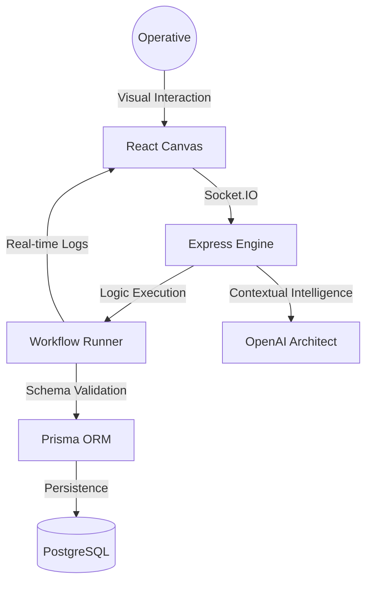

# FlowForge AI

FlowForge is a high-performance, AI-native visual workflow automation platform designed for modern enterprise operations. It provides a sophisticated node-based interface for architecting complex logic chains, powered by a real-time execution engine and integrated neural network assistance.

## System Architecture

The following diagram illustrates the high-level data flow and component interaction within the FlowForge ecosystem.

## Core Features

### Neural Architecture
Describe automation objectives in natural language to trigger the neural engine, which automatically scaffolds optimized workflow blueprints in seconds.

### High-Fidelity Canvas
A custom-built visual editor featuring specialized nodes for webhooks, database operations, and multi-service integrations, designed with a focus on cinematic density and user performance.

### Real-Time Telemetry
Stream execution logs and system metrics directly from the backend to the mission control dashboard via a dedicated Socket.IO synchronization layer.

### Enterprise Security
A robust authentication framework utilizing JSON Web Tokens (JWT) for secure session management and cross-service identity verification.

## Technology Stack

- **Frontend Environment:** Next.js 15, React 19, TypeScript, Tailwind CSS, Framer Motion, React Flow.
- **Backend Infrastructure:** Node.js, Express, Socket.IO, Prisma ORM, PostgreSQL.
- **Intelligence Layer:** OpenAI Integration for automated logic generation.

## Implementation Guide

### Prerequisites
- Node.js 18.0 or higher
- PostgreSQL Database
- OpenAI API Key (Optional for AI features)

### Backend Configuration
1. Navigate to the backend directory.
2. Install dependencies: `npm install`.
3. Configure the environment: `cp .env.example .env`.
4. Initialize the database schema: `npx prisma migrate dev`.
5. Start the engine: `npm run dev`.

### Frontend Deployment
1. Navigate to the frontend directory.
2. Install dependencies: `npm install`.
3. Configure the environment: `cp .env.example .env`.
4. Launch the interface: `npm run dev`.

## License
This project is licensed under the MIT License - see the LICENSE file for details.
